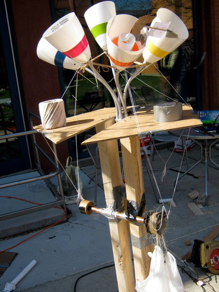
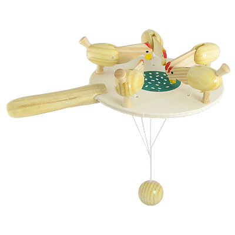
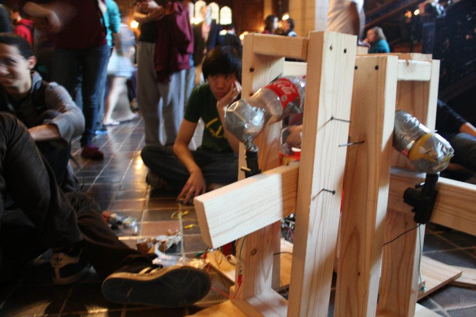
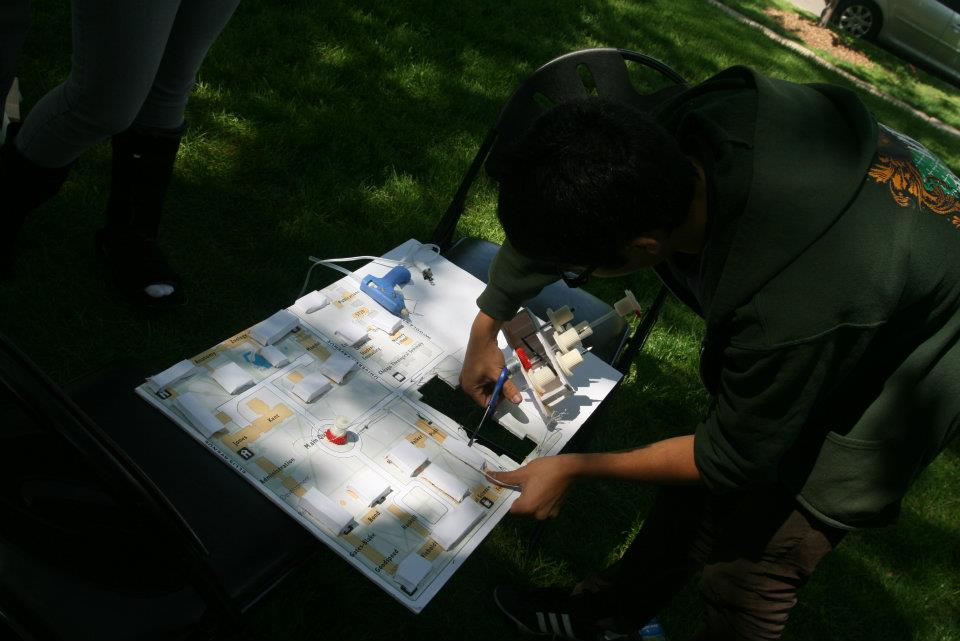

Title: Scav Highlights Through The Years
Date: 2013-08-30
Category: hardware
tags: scav

#Introduction

Every year, I, along with several hundred other students, partake in a four-day
journey into madness called Scav (short for the University of Chicago Scavenger
Hunt). We form teams of a few dozen each; on the Wednesday night before Mother's
Day we gather to receive the List, which contains around 300 items big and
small. Then begins the mad sprint to complete as many items as possible. On
Mother's Day itself we gather to show off what we have managed to complete.

Here are a few of the items I've worked on through the years. They're
not... pretty. Think of them as early-stage prototypes.

# 2011

This was my first year; I had yet to realize that there was a "Big Projects"
group that specialized in construction, so I signed up to take care of a page of
the List. I spent a lot of time hanging out with the Big Projects folks, but
here are some of the construct-y items from my page.

### The Lamp

*37. One of those cheap, many-headed colorful dorm floor lamps. [1 point
per head, 30 bonus points if they can move unaided, 10 bonus bonus
points if it is tearing apart a small ship]*

The mechanism was inspired by some toys I saw in China that looked like
this:

You swing the ball around, changing how much string goes to each chicken's
head. This moves them up and down.

We only had one motor on the whole team, so to "move the heads unaided" I used a
pulley and a weight. We didn't have those either. I rigged up a pulley with some
cardboard taped to a pipe. This rested inside a larger section of pipe so it
could spin freely. The weight was water bottles in a plastic bag. I added rubber
bands to pull the heads back and add tension to the string. This function is
served by gravity in the chicken toy, but I had no such luxury.

### The Eyes
*40. Affix a pair of appropriately enormous googly eyes to the campus
building of your choice. [8 points]*

** images! **

We originally planned on dangling them off the edge of the tower with wires. I
envisioned them swaying gently in the wind, pupils googling like mad for the
world to see. Getting these up there wasn't hard - we just went up with the
walking tour. Once we got to the top, we found that the wind was way too strong
and the eyes were flapping wildly. Fortunately, someone brought duct tape and we
just leaned over the edge and secured the eyes.

# 2012

This year, all the previous Big Projects folks had split, so I was heading up a
Big Projects team of one person. I holed up in the Big Projects space and worked
away at these items.

### The Piano

*146. Play me a drink, Sam, for old times’ sake...on your piano that
dispenses a beverage component with every keystroke. Changing the
melody should change the mixology. Instruments and their compositions
will be judged both on the quality of the cocktails and the musicality
of their recipes. [250 points, 25 extra points if your keyboard can
play a different melody to create a different drink]*

It's a little bit hacked together.

I mounted plastic bottles filled with liquor (or mixer) on short axles so their
neutral position would be right-side-up. I found these
[automotive door lock actuators](http://www.sciplus.com/p/POWER-DOOR-LOCK_47851)
at ASS that would push upwards a few inches when I applied a voltage across
them. I rested the bottles on them, so the bottles would tip over when the
actuators fired. I hooked up some wires to a mini keyboard, turning each key
into a switch that activated one of the bottles. Now each note played
corresponded to some alcohol poured! The alcohol went into a 10-inch funnel with
a glass at the end of it.

### The Map

*264. King’s Landing and The Twins are all right, I guess, but we’d
rather see something a little more neo-Gothic. Produce a map of the U
of C campus that when triggered erects a clockwork version of a campus
building of your choice. [175 points]*

One of many things we did not have time to make was a stand to hold it up.

We had to present this at 9:00 AM on Sunday. So, naturally, we started at 6:00
that morning. We had some gears lying around, but no shafts for them. Luckily,
the box of ballpoint pens we had bought were a great fit! So I got busy making a
replica of the very same chapel I had hung eyes from the year before.

Turns out, ours was the only one with a building that had moving gears on
it. However, the motor that was supposed to lift the building up from under the
map burned out when we were presenting.

During these three hours I learned how hard it was to work with foamcore
poster-board. But I forgot all about that when I started on Aquagraphics in 2013.

# 2013

This year I had assembled an actual Big Projects team! It was fantastic. We
could plan items together, build them together, all that jazz. I also spent a
lot more time with the rest of the team, helping people plan and build their own
technical items. This was much, much more fun than essentially working
alone. However, this meant I couldn't spend as much time on my own items.

### The Liver

*84. Take us on a Fantastic Voyage through your team’s larger-than-life
model of a human organ. Your structure must be able to comfortably
accommodate at least four tourists at a time and present an accurate
and informative account of the organ’s inner workings. We’ll happily
enter the body part of your choice, but remember that our heart belongs
to the Franklin Institute. [150 points]*

**images**

After much deliberation we settled on a liver. Because I like steel, we hiked
out to the local hardware store and bought a ton of electrical conduit and bent
it into a frame for the liver. The frame was much lighter and stiffer than a
comparable wooden or PVC one. We covered it in about 80 feet of chicken
wire. When we started tarping the liver, we found that it was so light that it
blew away! So we got some rope and stakes to keep it on the ground.

We filled the inside with some clear plastic tubes to represent the tubes inside
the liver, and some long twisty balloons so visitors could "fold their own
proteins." We hooked up a bottle of sweet tea vodka to one plastic tube to
represent bile, and a bottle of red Gatorade to another tube to represent blood.

### The Aquagraphics Curtain

*208. An aquagraphic-style water curtain that displays your team name or
logo. [250 points]*

[See my other post.](http://jdangerx.github.io/blog/208.html)
